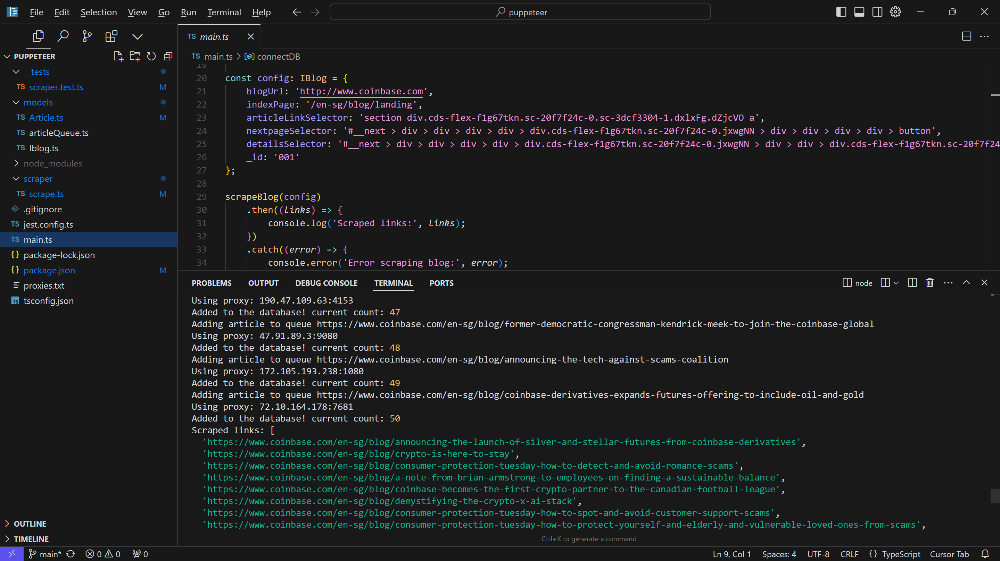
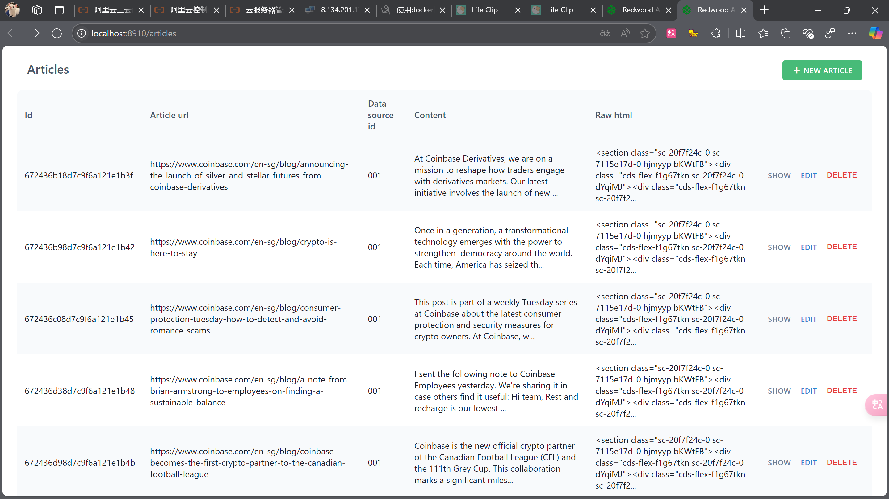

# Web3 Blog Scraper

This project is a **TypeScript + Puppeteer** blog scraper designed to extract article links and details from a specified blog. It connects to a **MongoDB database** to store the scraped data.It can **adjust the config selectors** to scrape different parts of the blog. Frontend is built with **Redwood.js**(https://github.com/zenvar/redwoodblog) and connected to the same MongoDB database.

## Features

- **Scrape Blog Articles**: Extracts article links and details from a specified blog URL.
- **MongoDB Integration**: Connects to a MongoDB database to store the scraped data.
- **Configurable Selectors**: Allows customization of CSS selectors for scraping different parts of the blog.Configured in `IBlog config`.
- **Proxy Support**: Supports using proxy pools to scrape the blog.Handle the IP blocking issue. Can configure to use the proxy pool in puppeteer `--proxy-server` option.
- **Error Handling and retries**: Handles errors gracefully and logs them to the console.
- **CI automated tests**: Set up a CI automated tests pipeline on GitHub Actions. Configured with `.github/workflows/ci.yml` file.

## Prerequisites

- Node.js (v14 or later,here is v21)
- MongoDB (running locally or accessible remotely)

## Setup

1. **Clone the repository**:
   ```bash
   git clone https://github.com/yourusername/blog-scraper.git
   cd blog-scraper
   ```

2. **Install dependencies**:
   ```bash
   npm install
   ```

3. **Configure MongoDB**:
   Ensure MongoDB is running locally or update the connection string in `main.ts` to point to your MongoDB instance.

4. **Run the scraper**:
   ```bash
   npm start
   ```
   or
   ```bash
   ts-node main.ts
   ```
   (which could be configured in package.json)

   Then you can see the console logs of the scraped data.
   

## Configuration

The scraper is configured using an `IBlog` object in `main.ts`. You can modify the following properties to suit your target blog:

- `blogUrl`: The base URL of the blog.
- `indexPage`: The path to the blog's landing page.
- `articleLinkSelector`: CSS selector to identify article links.
- `nextpageSelector`: CSS selector to identify the "next page" button.
- `detailsSelector`: CSS selector to identify article details.

for example:
```typescript
const config: IBlog = {
    blogUrl: 'http://www.coinbase.com',
    indexPage: '/en-sg/blog/landing',
    articleLinkSelector: 'section div.cds-flex-f1g67tkn.sc-20f7f24c-0.sc-3dcf3304-1.dxlxFg.dZjcVO a',
    nextpageSelector: '#__next > div > div > div > div > div.cds-flex-f1g67tkn.sc-20f7f24c-0.jxwgNN > div > div > div > div > button',
    detailsSelector: '#__next > div > div > div > div > div.cds-flex-f1g67tkn.sc-20f7f24c-0.jxwgNN > div > div > div.cds-flex-f1g67tkn.sc-20f7f24c-0.jqnGZy > section',
    _id: '001'
};
```

## Usage

After running the scraper, the console will display the scraped links. Any errors encountered during the scraping process will also be logged to the console.

The data will be stored in the MongoDB database for further processing or analysis.

Can be visualized and managed in **Redwood.js built-in web dashboard**
Links:https://github.com/zenvar/redwoodblog
.(They should be connected to the same MongoDB database.)




